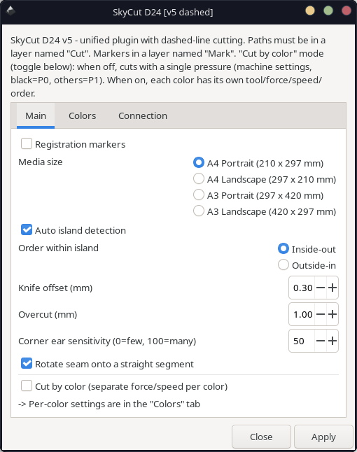
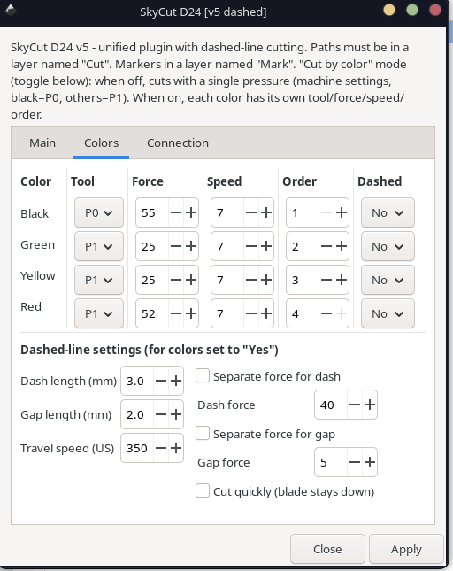
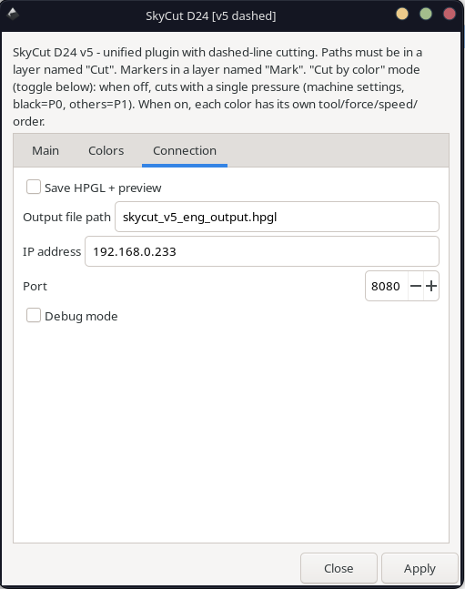
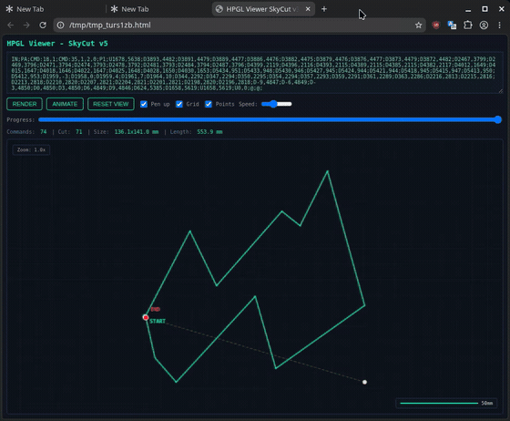
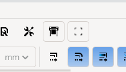

# SkyCut D24 Inkscape Extensions (Linux / Wi-Fi)

These Inkscape extensions send cutting jobs directly to a **SkyCut D24** plotter over **Wi-Fi (WLAN)**, bypassing the original Windows-only software. They provide a fully **Linux-compatible workflow** without the proprietary tools.

> ⚠️ **Note:** I am not a programmer. I created these extensions out of necessity, due to the lack of Linux support for the SkyCut D24, with the help of AI. They currently work only over Wi-Fi. USB or wired serial connections are not supported yet. Contributions for improvements, bug fixes, or USB support are welcome.

---

## 📦 Extensions

**SkyCut D24 [v5]** — the main, all-in-one plugin

A single plugin that covers the full workflow:

- **Single-pressure mode** (default) — cuts everything with one pressure set on the machine. Black = creasing (P0), other colors = cutting (P1). Ideal for boxes, packaging and general shapes.
- **Cut-by-color mode** (toggle in the *Main* tab) — each color gets its own tool, force (FS) and speed (VS), allowing kiss-cut and through-cut in a single job with one marker registration. Ideal for print-and-cut labels.
- **Dashed-line cutting** — any color can be set to cut as a perforation (dash/gap), with adjustable dash and gap force. With *Cut quickly* the blade stays down and only alternates pressure; without it the blade lifts in the gaps.

A Bulgarian (`skycut_v5`) and an English (`skycut_v5_eng`) build are provided — they are functionally identical, only the menu language differs.

> Earlier single-purpose plugins (`v3`, `v3 colors`, `v4`) are kept in the repo for reference, but **v5 supersedes them all**.

---

## 🖥️ The interface

The plugin has three tabs.

**Main** — choose the mode (single-pressure or cut-by-color), markers, media size, nesting, knife offset, overcut, corner-ear sensitivity and seam rotation.



**Colors** — per-color tool, force, speed, cutting order, and an optional dashed (perforation) setting, plus the shared dashed-line settings.



**Connection** — plotter IP / port, or save the HP-GL to a file with an HTML preview instead of cutting.



---

## 👁️ Built-in HP-GL viewer

When *Save HP-GL + preview* is enabled, the plugin opens an HTML viewer in your browser. It shows the cut paths in document orientation, with zoom/pan, a progress scrubber, and a step-by-step cut **animation** so you can preview the exact cutting order before sending the job.



---

## ✨ Features

- Automatic opening of closed contours (the firmware works only with open paths)
- Knife-offset compensation with corner arcs on sharp angles
- Overcut overlap at the seam
- Smart sharp-corner vs. rounded-curve detection (based on turn concentration)
- Optional start-point rotation onto a straight segment to hide the seam (toggle)
- Nesting with island detection and route optimization (nearest-neighbor + 2-opt)
- Adjustable corner-ear sensitivity
- Per-color force/speed control for kiss-cut + through-cut in one job
- **Dashed-line / perforation cutting**, with separate dash & gap force and a *Cut quickly* option
- L-shaped registration markers (layer `Mark`)
- Direct HP-GL output via TCP/IP (Wi-Fi)
- Built-in HTML viewer: document-oriented view, zoom/pan, progress scrubber, cut animation
- Optional toolbar buttons for one-click access (see below)
- Optional HP-GL file export for debugging
- Works on Linux, and should also work on macOS (Wi-Fi only)

---

## 🎨 Workflow

1. Create your design in a layer named **`Cut`**
2. (Optional) Place registration markers in a layer named **`Mark`**
3. Run **Extensions → SkyCutD24 Tools → SkyCut D24 [v5]**
4. In the **Main** tab, choose the mode:
   - leave *Cut by color* **off** for single-pressure cutting (machine settings), or
   - turn it **on** and set tool / force / speed / order (and optional dashed) per color in the **Colors** tab
5. Set the connection (IP / port) in the **Connection** tab, or enable *Save HP-GL + preview* to export instead of cutting
6. The plotter cuts your design

---

## 🎯 Color Logic

- **Black** → Creasing (P0) → executed first
- **Other colors** → Inner cuts (P1)
- **Red** → Outer contour (P1) → executed last

In cut-by-color mode, four colors (black, green, yellow, red) each have an independent tool, force, speed, cutting order, and an optional dashed (perforation) setting. Only the colors present in the document are cut.

---

## 🔪 Dashed-line cutting (perforation)

Set any color's **Dashed** option to *Yes* in the Colors tab, then configure the shared dashed settings:

- **Dash length** / **Gap length** (mm)
- **Dash force** / **Gap force** (optional — when off, the base color force is used)
- **Cut quickly** — when **on**, the blade stays down and only the pressure alternates (faster, gaps lightly scored); when **off**, the blade lifts in the gaps (clean breaks)
- **Travel speed** (US) — used only in dashed mode

This produces shapes that hold in place while cutting but tear away easily by hand.

---

## ⚙️ Requirements

- Inkscape 1.0 or newer (1.4+ recommended)
- SkyCut D24 plotter connected via **Wi-Fi (WLAN)**
- Layer names must be exactly `Cut` and `Mark`
- Python 3.x

---

## 🛠️ Installation

1. Copy the `.py` and `.inx` files to the Inkscape extensions folder:
   - **Linux:** `~/.config/inkscape/extensions/`
   - **Windows:** `%APPDATA%\Inkscape\extensions\`
   - **Mac:** `~/Library/Application Support/org.inkscape.Inkscape/config/inkscape/extensions/`
2. Restart Inkscape
3. Run the extension from **Extensions → SkyCutD24 Tools**

(Install `skycut_v5_eng.py` + `.inx` for the English menu, or `skycut_v5.py` + `.inx` for Bulgarian. Both can be installed at once — they appear as separate entries.)

---

## 🔘 Optional: Toolbar Buttons



If you'd rather launch the tools with one click instead of opening the
**Extensions** menu, you can add buttons directly to Inkscape's command toolbar
(the top bar with New / Open / Save).

A small installer in `toolbar-buttons-install/` automates this. It takes the
stock `toolbar-commands.ui` from your machine, injects the buttons into it, and
installs the matching icons — so it keeps working across Inkscape versions
instead of shipping a fixed toolbar file.

### Install

```bash
cd toolbar-buttons-install
python3 install_buttons.py
```

Then **fully restart Inkscape** (close all windows). The buttons appear at the
right end of the command toolbar.

### Quick install from a clone

If you don't keep the repo locally, you can clone it, run the installer, and
delete the clone afterwards. The installer copies everything it needs into your
user profile (`~/.config/inkscape` and `~/.local/share/icons`), so the clone is
not required to stay:

```bash
git clone https://github.com/trankata/inkscape-skycut-d24.git
cd inkscape-skycut-d24/toolbar-buttons-install
python3 install_buttons.py
cd ../..
rm -rf inkscape-skycut-d24
```

Then **fully restart Inkscape**.

> ℹ️ This only sets up the toolbar buttons. The buttons are shortcuts to the
> extensions, so make sure the extensions themselves are installed first (see
> **Installation** above). If you delete the clone, copy the extension files
> before removing it.

### Options

```bash
python3 install_buttons.py --reset      # rebuild from a clean toolbar, then inject
python3 install_buttons.py --uninstall  # remove the buttons and icons again
```

Re-running the plain install is safe — existing buttons are detected and skipped.
Use `--reset` if your toolbar ever gets out of sync (for example after upgrading
Inkscape, or if a button was added twice).

### Customizing / adding more buttons

Open `install_buttons.py` and edit the `BUTTONS` list near the top. Each entry
needs the action name (the **ID** shown in *Edit → Preferences → Interface →
Keyboard*), an icon name, a label and a tooltip:

```python
{
    "id":        "skycut_btn",
    "action":    "app.skycut.send.to.d24.v5.eng",
    "icon":      "skycut-cut",
    "icon_file": "skycut-cut.svg",
    "label":     "SkyCut",
    "tooltip":   "Open the SkyCut D24 plugin",
},
```

Put the matching SVG icon in `toolbar-buttons-install/icons/`. Icons should be a
clean 16×16 SVG (square, `viewBox="0 0 16 16"`, visible color).

> ⚠️ **Icon names must be unique.** A generic `icon-name` such as `markers`
> collides with a built-in Inkscape icon and the built-in one wins, so your icon
> won't show. Always prefix it, e.g. `skycut-…` or `corner-…`.

---

## 💡 Optional HP-GL Export

- Enable **"Save HP-GL + preview"** in the **Connection** tab
- Specify a file path
- The extension saves the HP-GL commands and an HTML preview instead of sending them to the plotter

---

## 📡 Command reference

See [`COMMANDS.md`](COMMANDS.md) for the reverse-engineered HP-GL / CMD command reference and a guide for adapting the plugin to other setups.

---

## 📜 License

GNU General Public License v3.0 or later

---

**Author:** Anton Kutrubiev (Bulgaria)
